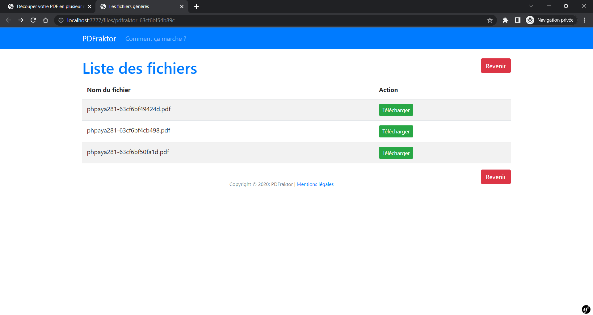

# PDFraktor

PDFraktor est une application web en symfony qui permet de découper un fichier pdf en plusieurs fichiers.


Les pages seront scindée en plusieurs parties dont le QR Code avec la valeur **_"intercalary"_** dans le fichier
servira d'intercalaire.



## Prérequis :

- make
- docker
- docker-compose

Aide pour les commande make :

```shell script
make help
```

Installation:

```shell script
make build
```

ou

```shell script
sudo make build
```
Par défaut le site est accessible sur le port **7777** de la machine hôte.

## Quelques commandes:
Lancer le conteneur sans build :
```shell script
make start
```

Arrêter le conteneur :
```shell script
make stop
```

installer les paquets composer et yarn
```shell script
make install
```

Migration de la base de données
```shell script
make sf-migration
```

Lancer symfony server cli (accessible sur le port **8888** de la machine hôte) :
```shell script
make sf-serve
```
Lancer wepback watch :
```shell script
make yarn-watch
```

Lancer d'autres commandes :
```shell script
docker-compose exec web <command>
```
